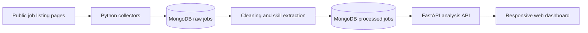

# Myanmar Job Market Intelligence

[](https://www.python.org/)
[](https://fastapi.tiangolo.com/)
[](https://www.mongodb.com/)
[](LICENSE)

An end-to-end data analysis project for understanding Myanmar's employment market. It collects publicly available job postings, normalizes semi-structured records, extracts demanded skills, and presents market and career insights in a responsive web dashboard.

> This is an independent educational project. It is not affiliated with or endorsed by any job portal. Collection must follow each website's robots.txt, terms, rate limits, and access policies.

## What makes this different from a job board?

A job board helps users find and apply for individual vacancies. This project analyzes the market across collected vacancies:

- hiring demand by industry and location;
- frequently requested technical and soft skills;
- education, experience, salary, and posting trends;
- case-insensitive job and skill search;
- job recommendations and skill-gap analysis;
- career-demand estimates and industry comparisons.

The dashboard links users to the original public posting when they want to inspect or apply for a role.

## Features

- Respectful, delayed collection with resumable URL processing
- Incremental MongoDB upserts and duplicate prevention
- Raw and normalized job collections
- Location, education, experience, job-type, and salary normalization
- Dictionary and text-based skill extraction
- Automatic reconciliation between raw and processed records
- Responsive HTML/CSS/JavaScript dashboard served by FastAPI
- Light/dark display switch for the current browser session
- Market filters, interactive Chart.js visualizations, and exact location counts
- Polling-based collection with configurable refresh intervals

## Architecture



## Technology stack

| Layer | Technologies |
|---|---|
| Collection | Python, Requests, Beautiful Soup, lxml |
| Processing | Pandas, NumPy, regular expressions, python-dateutil |
| Database | MongoDB, PyMongo |
| API | FastAPI, Uvicorn |
| Dashboard | HTML, CSS, JavaScript, Chart.js |
| Optional legacy explorer | Streamlit, Plotly, WordCloud |

## Project structure

```text
.
├── config/                 # Environment settings and skill dictionary
├── src/
│   ├── analysis/           # Aggregations and trend metrics
│   ├── api/                # FastAPI endpoints and dashboard server
│   ├── database/           # MongoDB connection and indexes
│   ├── pipeline/           # Collection, cleaning, processing, scheduling
│   └── scrapers/           # Portal listing and detail parsers
├── web/                    # Responsive dashboard UI
├── app/                    # Optional Streamlit dashboard
├── test_*.py               # Parser and pipeline smoke-test scripts
├── .env.example            # Safe configuration template
└── requirements.txt
```

## Quick start

### 1. Prerequisites

- Python 3.10 or newer
- A local MongoDB server or MongoDB Atlas connection
- Git

### 2. Clone and create an environment

```bash
git clone https://github.com/Thunnpoe/Myanmar-Job-Market-Analysis-System.git
cd Myanmar-Job-Market-Analysis-System
python -m venv .venv
```

Activate it on Windows PowerShell:

```powershell
.\.venv\Scripts\Activate.ps1
```

Or on macOS/Linux:

```bash
source .venv/bin/activate
```

Install dependencies:

```bash
python -m pip install -r requirements.txt
```

### 3. Configure the project

Copy the example file and edit it for your MongoDB instance:

```powershell
Copy-Item .env.example .env
```

On macOS/Linux:

```bash
cp .env.example .env
```

Never commit `.env`; it may contain database credentials.

### 4. Collect and process jobs

Run one complete collection cycle:

```bash
python -m src.pipeline.run_collection
```

Or run the polling collector continuously:

```bash
python -m src.pipeline.run_realtime
```

The realtime collector runs one cycle at a time and waits for the configured interval before starting the next one. Keep it in a separate terminal from the dashboard.

### 5. Start the dashboard

```bash
python -m uvicorn src.api.main:app --host 127.0.0.1 --port 8001
```

Open [http://127.0.0.1:8001](http://127.0.0.1:8001).

## Configuration

| Variable | Default | Purpose |
|---|---:|---|
| `MONGODB_URI` | `mongodb://localhost:27017/` | MongoDB connection string |
| `MONGODB_DATABASE` | `myanmar_job_market` | Database name |
| `REQUEST_DELAY_SECONDS` | `3` | Delay between requests |
| `MAX_LISTING_PAGES` | `200` | Maximum listing pages per source cycle |
| `SYNC_INTERVAL_MINUTES` | `180` | Time between realtime collection cycles |
| `REFRESH_AFTER_HOURS` | `24` | Age before an existing job detail is refreshed |
| `INACTIVE_AFTER_DAYS` | `3` | Time before an unseen posting becomes inactive |
| `SCRAPER_USER_AGENT` | project identifier | Responsible collector identification |

## API endpoints

| Endpoint | Purpose |
|---|---|
| `GET /api/health` | MongoDB and API health check |
| `GET /api/filters` | Available industries and locations |
| `GET /api/dashboard` | Dashboard metrics and chart data |
| `GET /api/search` | Case-insensitive vacancy search |
| `POST /api/recommendations` | Ranked job recommendations |
| `POST /api/skill-gap` | Target-role skill-gap analysis |
| `GET /api/demand-predictor` | Current career demand estimate |
| `POST /api/comparison` | Industry comparison metrics |

Interactive API documentation is available at `/docs` while the server is running.

## Data model

MongoDB uses two primary collections:

- `jobs`: raw, source-aligned job records;
- `processed_jobs`: normalized fields, extracted skills, lifecycle state, and analysis-ready values.

A unique compound index on `(source, url)` prevents duplicate postings. Job fields may be absent when the original posting does not disclose them.

## Responsible use and limitations

- Collect only publicly available information.
- Review robots.txt and the applicable website terms before collection.
- Keep delays enabled and avoid parallel or excessive requests.
- Do not bypass authentication, CAPTCHAs, access controls, or HTTP 403 restrictions.
- Portal layouts and access policies can change, so connectors may require maintenance or permission.
- Results describe successfully collected postings, not the entire Myanmar labor market.
- Recommendation and demand scores are analytical indicators, not guarantees.

## Roadmap

- Authorized additional data-source integrations
- Improved Myanmar-language text processing
- Historical posting-date backfill
- Geospatial location visualization
- Evaluation metrics for skill extraction and recommendations
- Automated unit and integration tests

## Contributing

Issues and pull requests are welcome. Please keep collectors rate-limited, document selector changes, avoid committing scraped personal data, and include a reproducible test case for parser changes.

## License

Released under the [MIT License](LICENSE). Website content and job postings remain the property of their respective owners.
